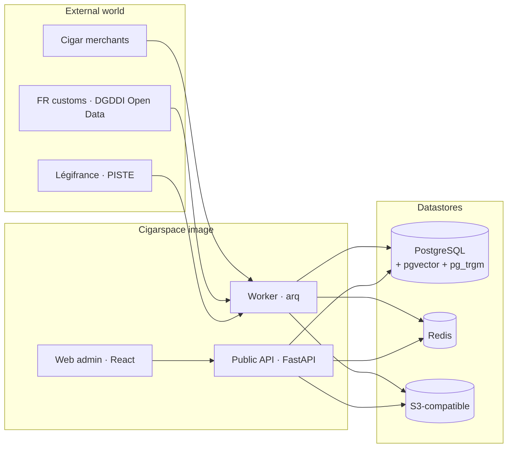

<p align="center">
  
</p>

<p align="center">
  <strong>An open knowledge platform for the global cigar market.</strong><br />
  Scrape merchants, ingest official customs prices, match them with
  semantic embeddings, expose everything through a strict RESTful API
  and a React admin.
</p>

<p align="center">
  <a href="LICENSE"></a>
  <a href="COMMERCIAL_LICENSE.md"></a>
  <a href="https://github.com/codexofc/cigarspace/actions/workflows/ci.yml"></a>
  <a href="https://codecov.io/gh/codexofc/cigarspace"></a>
  <a href="https://github.com/codexofc/cigarspace/releases"></a>
  
  
  
</p>

---

Cigarspace stitches together the three slices of cigar knowledge that
nobody keeps in one place:

1. **Merchant catalogues** — Mistercigar, Cigarpassion and a parser
   registry designed to grow merchant-by-merchant.
2. **Regulator prices** — official homologated retail prices, ingested
   from DGDDI Open Data, Légifrance via PISTE, and other juridictions.
3. **Audited matches** — embedding-based linkage between commercial
   SKUs and customs entries, with a human-in-the-loop review queue.

The whole thing ships as a self-contained Docker image, a public REST
API, and an admin SPA.

## Quickstart (30 seconds, with the demo image)

```bash
docker run --rm -p 8080:80 ghcr.io/codexofc/cigarspace:demo
open http://localhost:8080
```

This `:demo` image embeds PostgreSQL+pgvector and Redis so the full
stack lives in a single container. Production deployments use the
lighter `:latest` image with external Postgres/Redis/S3 — see
[`docs/deployment/`](docs/deployment/docker.md).

To bootstrap an admin from another terminal while the demo runs:

```bash
docker exec <container> /app/.venv/bin/cigarspace users create \
  --email admin@example.com --password 's3cret' --admin
```

## What's inside

- **Tiered HTTP fetcher** with TLS-fingerprint impersonation
  (`curl_cffi`), optional ProtonVPN sidecar (gluetun), Tor SOCKS5
  fallback and a patched-Chromium last resort (`patchright`).
- **Domain-driven Python core**: pure Pydantic entities, async
  SQLAlchemy 2.0, an explicit Unit-of-Work boundary, no I/O in the
  domain layer.
- **arq-based workers** orchestrated by Redis queues; cron schedules
  for daily / weekly customs refreshes.
- **pgvector + sentence-transformers (mpnet 768-d) + rapidfuzz** —
  hybrid matching pipeline with four weighted signals (`exact`, `fuzzy`,
  `vector`, `pack_compat`) and an auditable score → status workflow
  (`AUTO_ACCEPTED / PENDING_REVIEW / AUTO_REJECTED / HUMAN_ACCEPTED /
  HUMAN_REJECTED`). Human verdicts are protected across rematches.
- **FastAPI public API** following strict REST conventions: plural
  resources, PATCH for state transitions, OAuth2 (RFC 6749) with
  refresh-token rotation, RFC 7807 errors, ETag/304 on detail
  endpoints, RFC 5988 `Link` headers on lists, OpenAPI 3.1 auto-generated
  and a contract test that fails if any route is missing a `summary`
  or response schema.
- **React + Vite + Tailwind + shadcn web admin** with a hybrid search
  bar, a cigar browse + detail view, a `PENDING_REVIEW` queue with
  accept/reject + notes modal, and admin actions to trigger refreshes /
  reruns.
- **Docker image variants** built multi-arch by CI: `:latest` (api +
  worker + nginx + SPA) and `:demo` (above + embedded PG + Redis).

## Architecture at a glance



A deeper dive lives in [`docs/architecture.md`](docs/architecture.md).

## API surface

`OpenAPI 3.1` is auto-generated by FastAPI and published at:

- Swagger UI — `GET /api/v1/docs`
- ReDoc — `GET /api/v1/redoc`
- Raw schema — `GET /api/v1/openapi.json`

Pop highlights:

```http
POST /api/v1/oauth/token            issue access + refresh tokens (RFC 6749)
POST /api/v1/auth/login              browser flow (sets HttpOnly cookie)
GET  /api/v1/cigars?page=1           paginated browse with filters
GET  /api/v1/cigars/search?q=…       hybrid full-text + vector search (RRF)
GET  /api/v1/cigars/{slug}           full detail incl. accepted matches
GET  /api/v1/matches?status=pending_review   review queue (admin)
PATCH /api/v1/matches/{id}           apply a human verdict (admin)
POST /api/v1/customs-sources/{code}/refresh-jobs   admin async refresh
POST /api/v1/match-jobs              admin async matcher run
```

## Documentation map

- [`docs/architecture.md`](docs/architecture.md) — system overview,
  layered DDD, sequence diagrams.
- [`docs/data-model.md`](docs/data-model.md) — Postgres schema + ER
  diagram.
- [`docs/matching-pipeline.md`](docs/matching-pipeline.md) — signals,
  RRF, human-in-the-loop.
- [`docs/customs-sources.md`](docs/customs-sources.md) — adapter
  contract + jurisdictions.
- [`docs/deployment/`](docs/deployment/) — Docker images, production
  hardening, scaling.
- [`docs/development/`](docs/development/) — clone-to-running, testing,
  release process.
- [`docs/adr/`](docs/adr/) — Architecture Decision Records.

## Tech stack

| Layer        | Technology                                                       |
| ------------ | ---------------------------------------------------------------- |
| HTTP API     | FastAPI 0.110+, Uvicorn, Pydantic v2, PyJWT, argon2-cffi, slowapi |
| Persistence  | PostgreSQL 16 + pgvector + pg_trgm, SQLAlchemy 2.0 async, Alembic |
| Workers      | arq (Redis-backed), structlog                                    |
| Scraping     | curl_cffi (Chrome impersonation), httpx, selectolax, patchright  |
| Matching     | sentence-transformers (mpnet 768-d), rapidfuzz, pgvector HNSW    |
| Media        | Pillow + WebP, BLAKE3 hashes, SeaweedFS / S3-compatible storage  |
| CLI          | Typer + Rich                                                     |
| Web          | React 18 + TypeScript + Vite + Tailwind + shadcn-flavoured UI    |
|              | TanStack Query, Zustand, React Router 6, react-hook-form         |
| Build        | uv (Python), npm (web), Docker Buildx multi-arch                 |
| CI / release | GitHub Actions, release-please, CodeQL, OpenSSF Scorecard        |

## License

Cigarspace is released under the
[PolyForm Noncommercial 1.0.0](LICENSE). Personal, research and
contribution use are free; **commercial use requires a separate
license** — see [`COMMERCIAL_LICENSE.md`](COMMERCIAL_LICENSE.md).
Third-party dependency licenses are inventoried in
[`NOTICE`](NOTICE).

## Contributing

We welcome contributions. Read [`CONTRIBUTING.md`](CONTRIBUTING.md)
before opening a PR — it covers branch naming, Conventional Commits,
DCO sign-off, the test matrix and the PR checklist. Code of conduct,
security policy, changelog and support guidance live alongside.

## Acknowledgements

Built on the shoulders of FastAPI, pgvector, sentence-transformers,
SQLAlchemy, arq, curl_cffi, shadcn, Tailwind and a dozen other open
source projects — see [`NOTICE`](NOTICE) for the inventory.
