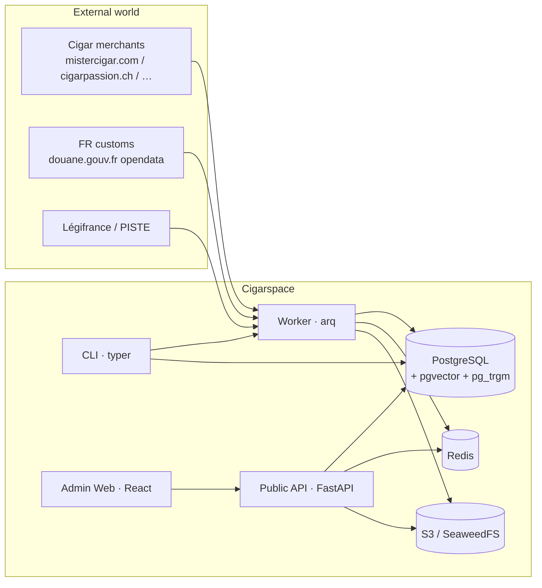
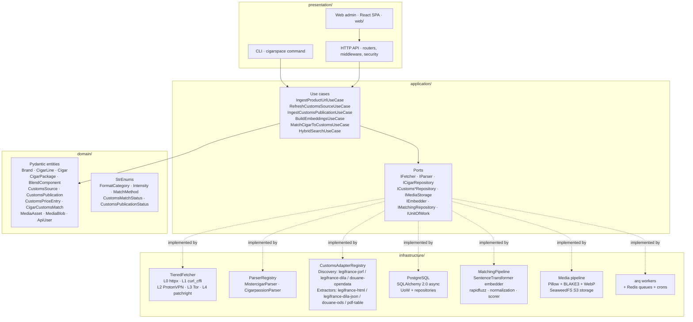

# Architecture

Cigarspace is a layered DDD application. The repository follows a strict
4-folder layout under `src/`:

```
src/
  domain/          Pure Pydantic entities, enums, value objects.
  application/     Ports (Protocols) + use cases. No I/O.
  infrastructure/ Concrete adapters: PG repositories, S3 storage, HTTP fetchers,
                  parsers, customs adapters, embedder, worker, etc.
  presentation/    Entry points: CLI (typer) and HTTP API (FastAPI).
```

External I/O never bleeds into `domain/` or `application/`. The
`application/ports/` Protocols are the contract; `infrastructure/`
implements them; `presentation/` wires them together.

## High-level system



## Layered structure



## Request flow — public read

A `GET /api/v1/cigars/{slug}` traverses:

1. `presentation/api/routers/cigars.py` — extracts the slug, calls
   `dependencies.get_uow()` to obtain a transactional UoW.
2. `application/ports/cigar_repository.py::ICigarRepository.get_by_slug` —
   the contract.
3. `infrastructure/persistence/repositories/cigar.py::PgCigarRepository` —
   issues an async SQLAlchemy query.
4. `infrastructure/persistence/mappers.py` — translates the ORM row into
   the `domain/entities/cigar.py::Cigar` Pydantic entity.
5. The router serialises the entity into `presentation/api/schemas/cigar.py`
   (with HATEOAS `_links`) and returns it.

Every layer talks to the next via Protocols / Pydantic, never with
concrete adapters.

## Background-job flow

Triggered by a CLI command, an API admin endpoint, or a cron in the
worker definition:

1. `presentation/cli/__main__.py` or `routers/match_jobs.py` enqueues
   a job into the Redis queue `cigarspace:default` via `arq`.
2. `infrastructure/workers/worker.py` worker process picks the job,
   loads the appropriate use case, runs it inside a UoW.
3. Side effects (e.g. embeddings written, media downloaded, customs
   parsed) commit transactionally.
4. The CLI / API client polls `GET /api/v1/jobs/{id}` (admin) to read
   status — backed by arq's job metadata in Redis.

## Persistence model

See [`data-model.md`](./data-model.md) for the full ER diagram and
table-by-table description.

## Matching pipeline

See [`matching-pipeline.md`](./matching-pipeline.md) for the four signals
(`exact`, `fuzzy`, `vector`, `pack_compat`), the Reciprocal Rank Fusion
formula and the workflow that protects `HUMAN_*` verdicts across
re-runs.

## Customs sources

See [`customs-sources.md`](./customs-sources.md) for the adapter
registry, the source-of-truth for each jurisdiction, and the steps to
add a new country.

## Deployment

See [`deployment/docker.md`](./deployment/docker.md) and
[`deployment/production.md`](./deployment/production.md).
