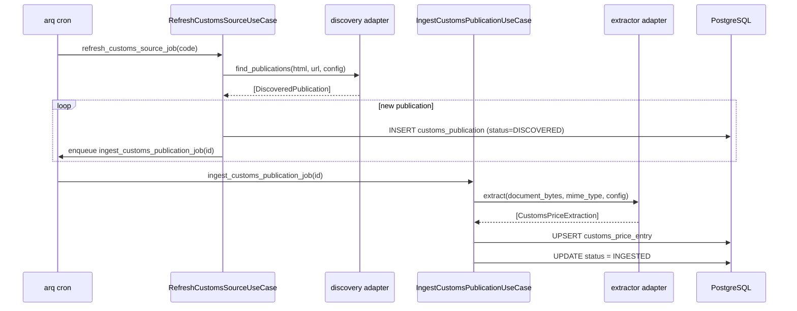

# Customs sources

Cigarspace ingests homologated retail prices for cigars from several
regulatory channels. Each channel is plugged in through two adapters:

- a **discovery** adapter that walks the source's index and yields
  `DiscoveredPublication` records,
- an **extractor** adapter that turns one document into N
  `CustomsPriceExtraction` records.

Both are registered in `application/services/customs_registry.py`. The
registry is populated by importing the `infrastructure/customs/`
package on worker startup.

## Seeded sources (v1)

| Code | Country | Discovery | Extractor | Status |
| --- | --- | --- | --- | --- |
| `fr-legifrance-jorf` | FR | `legifrance-jorf` (HTML) | `legifrance-html` | Inactive (WAF returns 403 in prod) |
| `fr-legifrance-dila` | FR | `legifrance-dila` (PISTE/OAuth) | `legifrance-dila-json` | Active for **regulatory traceability** only — JORF arrêtés stopped embedding the price table in 2024 |
| `fr-douane-opendata` | FR | `douane-opendata` (HTML index + ODS) | `douane-ods` | **Active — canonical price source** |
| `ch-ofdf` | CH | `generic-html-index` | `ofdf-generic` | Seeded inactive — URL TBD |

The seed file is `config/customs_sources.yaml`; the CLI command
`cigarspace customs-seed` UPSERTs it.

## Discovery + extraction flow



## France — DGDDI Open Data (canonical)

Since 2024, JORF arrêtés on tobacco prices no longer embed the price
table; article 1 redirects readers to
`https://www.douane.gouv.fr/la-douane/opendata/categories/tabacs-manufactures`
where the DGDDI publishes a `Maquette JORF <date>.ods` file per arrêté.

`douane-opendata` (discovery) parses the HTML index, follows the `.ods`
links, derives a synthetic `regulator_reference` like
`FR-DOUANE-YYYY-MM-DD` from the filename, and stores the URL.

`douane-ods` (extractor) parses the OpenDocument file via `odfpy`. It
walks the rows maintaining the current `FOURNISSEUR / FABRICANT /
category` and yields `CustomsPriceExtraction` records with
`raw_brand_label`, `raw_product_label`, `pack_size`, `unit_price` and
`tax_class`.

## France — DILA via PISTE (traceability)

`legifrance-dila` calls the PISTE OAuth2 API at
`api.piste.gouv.fr/dila/legifrance/lf-engine-app/search` with the query
`homologation prix tabacs manufactures` (title-restricted,
`TOUS_LES_MOTS_DANS_UN_CHAMP`). The NOR appears at the top level of
each result; the `regulator_reference` we persist is the NOR
(`ECOI…A`, `CPPD…A` …).

`legifrance-dila-json` (extractor) fetches the corresponding
`/consult/jorf/{cid}` JSON via OAuth and reuses the `legifrance-html`
table extractor on the embedded `articles[*].content` HTML. For modern
arrêtés the content carries no table, so the extractor returns 0
entries — *this is expected* and documented in
[`project_fr_pricing_pivot_opendata`](../memory/project_fr_pricing_pivot_opendata.md)
in the original development notes.

## Adapter contract

```python
class ICustomsDiscoveryAdapter(Protocol):
    name: ClassVar[str]
    requires_index_fetch: ClassVar[bool] = True   # False for API adapters

    async def find_publications(
        self, *, index_html: str, index_url: str, config: dict[str, Any],
    ) -> Sequence[DiscoveredPublication]: ...


class ICustomsExtractorAdapter(Protocol):
    name: ClassVar[str]
    version: ClassVar[str]
    requires_document_fetch: ClassVar[bool] = True  # False for API adapters

    async def extract(
        self, *, document_bytes: bytes, mime_type: str,
        default_currency: str, config: dict[str, Any],
    ) -> Iterable[CustomsPriceExtraction]: ...

    async def fetch_document(
        self, *, document_url: str, config: dict[str, Any]
    ) -> bytes:
        """Only implemented when requires_document_fetch is False."""
```

The two `requires_*_fetch` flags let API-backed adapters short-circuit
the generic `fetcher.fetch()` step that the use case applies for
HTML-only sources (DILA and the PISTE consult endpoint require POST +
OAuth, not GET).

## Adding a new jurisdiction

1. Drop a new discovery file under
   `src/infrastructure/customs/discovery/<jurisdiction>.py`,
   subclassing `ICustomsDiscoveryAdapter`.
2. Add an extractor under `src/infrastructure/customs/extractors/`.
3. Register both at the bottom of the discovery / extractors
   `__init__.py`.
4. Append a row to `config/customs_sources.yaml`, then run
   `cigarspace customs-seed`.
5. `cigarspace customs-discover --source <code>` exercises the
   end-to-end flow.

The Swiss `ch-ofdf` source is seeded inactive because the regulator's
URL discovery has not been confirmed yet; once the URL is identified,
an `UPDATE customs_source SET index_url = '…', is_active = true WHERE
code = 'ch-ofdf';` flips it on without redeploy.
