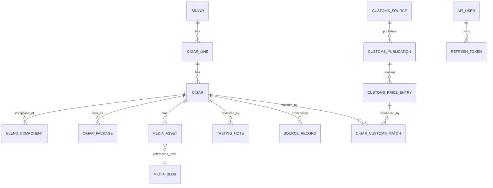

# Data model

PostgreSQL 16 with two extensions:

- `pgvector` (HNSW indexes on `cigar.embedding`, `customs_price_entry.embedding`).
- `pg_trgm` (GIN indexes on `cigar.full_name/slug`, `brand.name`, `cigar_line.name`).

Both are baked into the `pgvector/pgvector:pg16` Docker image we use.

## Entity-relationship overview



## Tables (high-level)

### Catalogue

- **`brand`** — commercial brand (Cohiba, Padrón…). Unique slug.
- **`cigar_line`** — product line within a brand (Behike, 1964
  Anniversary…). FK `brand_id`.
- **`cigar`** — canonical product (`brand + line + vitola`). Carries
  the dimensions (length, ring gauge, weight), origins
  (wrapper/binder/filler), tasting profile (JSONB) and an
  `embedding vector(768)` populated by the matching pipeline.
- **`blend_component`** — N rows per cigar, one per tobacco leaf
  (wrapper / binder / N fillers).
- **`cigar_package`** — merchant-side packaging variant (pack of 1, 5,
  25). Carries price + source URL.

### Media

- **`media_blob`** — content-addressed by BLAKE3 hash. One row per
  unique image bytes, regardless of how many cigars reference it.
- **`media_asset`** — relation between a cigar and a blob, plus the
  original URL and asset type (front, band, foot, lifestyle…).

### Customs

- **`customs_source`** — regulatory channel (`fr-legifrance-jorf`,
  `fr-legifrance-dila`, `fr-douane-opendata`, `ch-ofdf`). Carries the
  index URL and the names of the discovery + extractor adapters.
- **`customs_publication`** — one regulatory document per source (a
  JORF arrêté, a DGDDI ODS file). Lifecycle status
  (`discovered → fetched → parsed → ingested`).
- **`customs_price_entry`** — one homologated price line per
  publication. Carries `unit_price`, `currency_code`, `pack_size`,
  `tax_class` and an `embedding vector(768)`.

### Matching

- **`cigar_customs_match`** — audited link between a `cigar` and a
  `customs_price_entry`. Carries the `match_method`,
  `score numeric(4,3)`, four `signals` (JSONB: exact, fuzzy, vector,
  pack_compat) and a `status`:

```
AUTO_ACCEPTED   matcher confident enough to auto-approve
PENDING_REVIEW  matcher unsure, awaits a human
AUTO_REJECTED   matcher below the floor (rarely persisted)
HUMAN_ACCEPTED  operator approved through PATCH /matches/{id}
HUMAN_REJECTED  operator rejected
```

`HUMAN_*` statuses are **never** overwritten by a subsequent matcher
run — protected by a guard in the UPSERT (`WHERE status NOT IN
('HUMAN_ACCEPTED','HUMAN_REJECTED')`).

### Auth (API)

- **`api_user`** — operator account (email/argon2-hash/is_admin).
- **`refresh_token`** — sha256 of an opaque refresh secret, with
  expires_at + revoked_at. The rotation + cascade-revoke logic is in
  `presentation/api/security/oauth.py`.

### Tasting + provenance

- **`tasting_note`** — reviewer-provided cigar review (score, text,
  pairing recommendations).
- **`source_record`** — provenance (which URL was scraped when, what
  parser version, what HTTP status), used to debug ingestion.

## Migrations

All schema changes go through Alembic in `migrations/versions/`. The
ones that ship with v1.0.0 (in chronological order):

1. Initial schema (all the tables above except embeddings + api auth).
2. `cigar_package` table.
3. `media_blob` + media asset refactor.
4. Customs multi-country refactor (`customs_source`, `customs_publication`,
   `customs_price_entry` schema split).
5. Matching pgvector + status workflow + signals JSONB.
6. API users + pg_trgm trigram indexes.

The `cigarspace-entrypoint` script in the Docker image runs
`alembic upgrade head` on boot — a fresh container always lands on the
latest schema.
