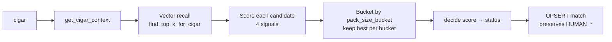

# Matching pipeline

Given a `cigar` from a merchant catalogue, the pipeline finds the
matching `customs_price_entry` rows (often several — one per pack size)
and records the verdict in `cigar_customs_match`.

## Inputs

- `cigar.embedding` — 768-d dense vector produced by
  `sentence-transformers/paraphrase-multilingual-mpnet-base-v2` on the
  text `"<brand> <line> <full_name>"` (HTML annotations like `(10 X 5)`
  stripped in SQL).
- A merchant-known set of pack sizes for the cigar (via `cigar_package`).
- The customs catalogue, with each entry carrying its own embedding and
  pack size.

## Pipeline



### 1. Vector recall

`PgMatchingRepository.find_top_k_for_cigar` issues:

```sql
SELECT id, …, embedding <=> :cigar_embedding AS cosine_distance
  FROM customs_price_entry
 WHERE country_code = :country_code
   AND embedding IS NOT NULL
   AND tax_class ILIKE :tax_class_like
 ORDER BY embedding <=> :cigar_embedding
 LIMIT :k;
```

The HNSW index on `embedding` keeps this sub-millisecond even at 12k+
rows.

### 2. Signals

Four signals, each in `[0, 1]`, computed in pure Python on the recalled
candidates:

| Signal       | Range  | Source                                                          |
| ------------ | ------ | --------------------------------------------------------------- |
| `exact`      | 0..1   | Asymmetric token-set: `\|tokens(cigar) ∩ tokens(customs)\| / min(\|a\|,\|b\|)`. Captures "customs label fully contained in cigar" cases. |
| `fuzzy`      | 0..1   | `rapidfuzz.fuzz.token_set_ratio / 100`. Robust to small spelling drift. |
| `vector`     | 0..1   | `1 - cosine_distance` returned by pgvector. Semantic proximity. |
| `pack_compat`| 0..1   | Heuristic ladder: exact match → 1.0, unknown → 0.7, ratio ≥ 0.8 → 0.8, ≥ 0.5 → 0.5, ≥ 0.2 → 0.3, else → 0.2 (never zeroes out a good match). |

### 3. Weighted score

```
score = 0.40 · exact
      + 0.25 · fuzzy
      + 0.25 · vector
      + 0.10 · pack_compat
```

Persisted on each match as `signals` (JSONB) so the score can be
recomputed after a weight change without re-running the embedder.

### 4. Bucketing

Customs entries for the same cigar may exist under several `pack_size`
values (unit, box of 5, box of 25). We keep **one match per
`pack_size_bucket`** — the best-scoring candidate — so a cigar can carry
several accepted matches simultaneously, one per commercial conditioning.

### 5. Decision thresholds

```
score ≥ 0.85  → AUTO_ACCEPTED   (Confidence.HIGH)
score ≥ 0.50  → PENDING_REVIEW  (Confidence.MEDIUM or .LOW)
score <  0.50 → AUTO_REJECTED   (not persisted)
```

The thresholds + weights live in `infrastructure/matching/scorer.py`
so they can be re-tuned without touching the use case.

### 6. UPSERT with HUMAN_* protection

`PgCigarCustomsMatchRepository.upsert` uses
`ON CONFLICT … DO UPDATE … WHERE status NOT IN ('HUMAN_ACCEPTED',
'HUMAN_REJECTED')`. A subsequent matcher run will:

- Overwrite an `AUTO_ACCEPTED` row if a stronger candidate emerges.
- **Never** overwrite a row an operator decided on through
  `PATCH /api/v1/matches/{id}`.

This contract is enforced by the repository test
`tests/application/matching/test_match_cigar_to_customs.py::
test_human_status_is_preserved_across_rematch`.

## Operator workflow

1. **Browse the queue** — `GET /api/v1/matches?status=pending_review`.
   The web admin under `/matches/pending` lists each entry with cigar,
   customs entry, pack size, score, and the four signals.
2. **Decide** — `PATCH /api/v1/matches/{id}` with
   `{ "status": "human_accepted", "notes": "..." }` (or `human_rejected`).
3. **Re-run** — `POST /api/v1/match-jobs` with `scope=all` rebuilds the
   match table; human verdicts survive.

## Tuning the matcher

When the false-positive rate climbs on a specific subset (e.g. cheap
cigarillo SKUs):

- Persist a counter-example as a `HUMAN_REJECTED` match — the matcher
  learns nothing from it (no online training), but it stops surfacing
  the case in the queue.
- If many of the same shape are wrong, edit `infrastructure/matching/
  _signals.py` (e.g. tighten `pack_compat_score` thresholds) and run
  `cigarspace match-all` again. The score histograms in PG help
  decide a sensible new threshold.
